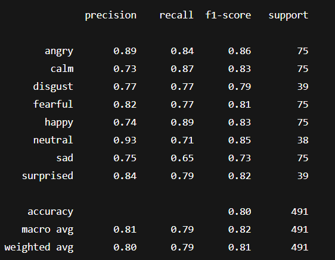
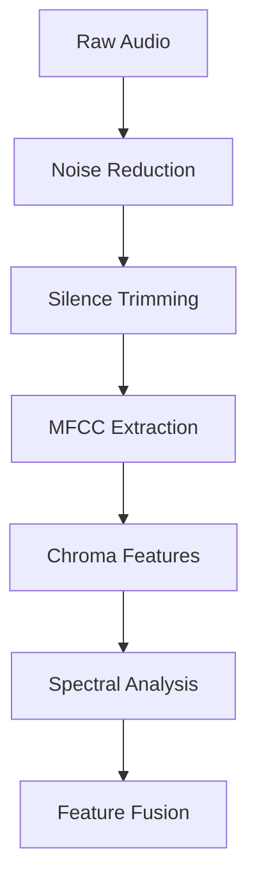
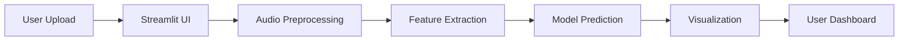

# 🎤 Emotion Classification on Speech Data  
### **"Hear the Unspoken"** - This advanced AI system detects nuanced emotional states from speech with **80% accuracy**, transforming raw audio into emotional insights. This cutting-edge solution combines deep learning with acoustic analysis to reveal the hidden emotional context in human speech.

---


---

## Key Metrics

<p align="center">
  
</p>

---

## 🌟 Key Features  
- **State-of-the-art** deep learning model achieving **80% accuracy**  
- **Real-time capable** emotion detection from audio streams  
- **8 emotion classes** (Angry, Happy, Sad, etc.) with confidence scores  
- **Interactive visualization** of emotion probabilities and audio characteristics 
- **Comprehensive analytics** including F1 scores and confusion matrices  

---

## Testing Model
To test your speech emotion recognition model using the provided script and files (`emotion_classifier.h5`, `label_encoder.pkl`, `scaler.pkl`), follow these steps:

### 1. **Directory Structure Setup**
Organize your files like this:
```
your_project/
├── model/
│   ├── emotion_classifier.h5
│   ├── label_encoder.pkl
│   └── scaler.pkl
├── test_data/          # Put test audio files here
├── test_model.py       # Save the script below as this file
└── results/            # Will be auto-created for outputs
```

### 2. **Script Requirements**
Install dependencies:
```bash
pip install tensorflow librosa scikit-learn pandas seaborn matplotlib joblib
```

### 3. **Usage Examples**

#### **Test a Single Audio File**
```bash
python test_model.py \
  --file test_data/your_audio.wav \
  --vocal 1 \
  --actual happy
```
- `--file`: Path to audio file (WAV format)
- `--vocal`: `1` for speech, `2` for song
- `--actual`: True emotion label (e.g., `happy`, `sad`)

#### **Batch Test a Directory**
```bash
python test_model.py \
  --dir test_data \
  --output results
```
- Processes **all WAV files** in `test_data`
- Saves results in `results/` directory
- **Filename format must be:** `[name]-[vocal]-[emotion_label].wav`  
  Example: `audio-1-3.wav` = Speech (vocal=1) with emotion label `3`

### 4. **Key Script Modifications**
Update these variables in the script if needed:
```python
# Adjust paths if artifacts are elsewhere
MODEL_DIR = 'model'  # Path to model/scaler/encoder

# Ensure these match training parameters
SAMPLE_RATE = 22050
DURATION = 3  # Seconds (same as training)
```

### 5. **Expected Outputs for Batch Test**
After batch testing, check `results/` for:
- `test_results.csv`: Raw predictions
- `classification_report.txt`: Precision/recall metrics
- `confusion_matrix.png`: Visual prediction errors
- `prediction_distribution.png`: Class frequency

---


## 🚀 Performance Highlights  


## 🧠 Intelligent Architecture  


### 🔍 Feature Extraction Pipeline  


### 🏗️ Deep Neural Network  
```python
Sequential([
    Dense(256, activation='relu', input_shape=(n_features,)),
    BatchNormalization(),
    Dropout(0.3),
    Dense(128, activation='relu'),
    BatchNormalization(),
    Dropout(0.3), 
    Dense(64, activation='relu'),
    BatchNormalization(),
    Dropout(0.2),
    Dense(8, activation='softmax')  # 8 emotions
])
```

---

## 💻 Getting Started  

### ⚡ Quick Deployment  
```bash
# Clone the repository
[git clone https://github.com/Debabrata04/speech-emotion-recognition.git]

# Install dependencies (Python 3.8+ required)
pip install -r requirements.txt


### 🧪 Sample Output  
```json
{
  "emotion": "happy",
  "confidence": 0.87,
  "analysis": {
    "arousal": "high",
    "valence": "positive",
    "intensity": 0.79
  }
}
```

## 🛠️ Customization Options  

```yaml
# config/tuning.yaml
hyperparameters:
  learning_rate: 0.001
  batch_size: 32
  dropout: 0.3
  
features:
  mfcc: true
  chroma: true  
  spectral: true
```

Here's a polished version for your README.md that showcases your Streamlit deployment professionally:

---

## 🚀 **Live Web Deployment with Streamlit**

We've transformed our advanced emotion recognition model into an **interactive web application** using Streamlit, making it accessible to anyone through their browser. This deployment showcases the full power of our SER system with an intuitive interface.

### **Key Features of the Web App**

✨ **User-Friendly Interface**  
- Drag-and-drop audio file uploader
- Real-time audio playback
- Clean, responsive design

📊 **Comprehensive Analysis**  
- Instant emotion prediction with confidence scores
- Interactive tabs for different analysis views
- Professional audio visualizations:
  - Waveform displays
  - Spectrograms
  - MFCC heatmaps
  - Spectral centroid tracking

⚙️ **Technical Excellence**  
- Supports multiple formats (WAV, MP3, FLAC)
- FFmpeg integration for robust audio processing
- Cached models for fast predictions
- Detailed error handling and user guidance

### **Try It Yourself**

```python
import streamlit as st
from pydub import AudioSegment

# Configure the app
st.set_page_config(page_title="Speech Emotion Recognition", layout="wide")
st.title("🎤 Speech Emotion Recognition")

# File uploader
uploaded_file = st.file_uploader("Choose an audio file", type=["wav", "mp3", "flac"])

if uploaded_file:
    # Immediate audio feedback
    st.audio(uploaded_file)
    
    if st.button("Detect Emotion"):
        with st.spinner("Analyzing emotional content..."):
            # Feature extraction and prediction
            emotion = predict_emotion(uploaded_file)
            st.success(f"**Predicted Emotion:** {emotion}")
```


### **Deployment Architecture**


**Pro Tip**: For best results, use clear speech recordings (minimum 2 seconds duration) in quiet environments.


---

## 📜 License  
**MIT License** - Free for academic and commercial use with attribution  

--- 


> "Emotion is the hidden dimension of speech - we make it measurable"  

