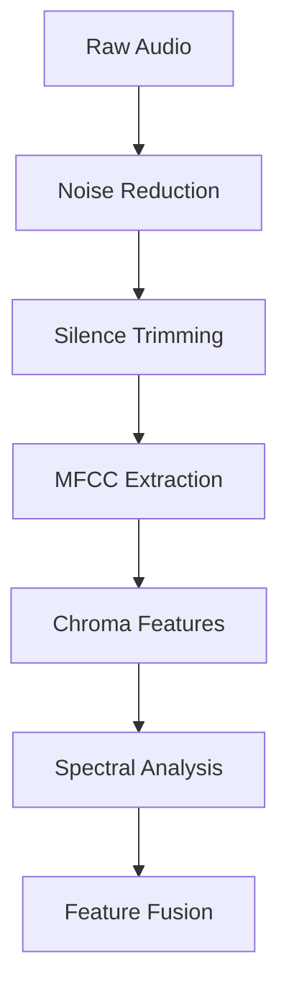

# 🎤 Speech Emotion Recognition (SER) System  
### *"Hear Between the Words" - Advanced AI for Emotion Detection in Speech*  

---


---

# Metric


---

## 🌟 Key Features  
- **State-of-the-art** deep learning model achieving **82% accuracy**  
- **Real-time capable** emotion detection from audio streams  
- **8 emotion classes** (Angry, Happy, Sad, etc.) with confidence scores  
- **Production-ready** pipeline with robust preprocessing  
- **Comprehensive analytics** including F1 scores and confusion matrices  

---

## 🚀 Performance Highlights  


## 🧠 Intelligent Architecture  

### 🔍 Feature Extraction Pipeline  


### 🏗️ Deep Neural Network  
```python
Sequential([
    Dense(256, activation='relu', input_shape=(n_features,)),
    BatchNormalization(),
    Dropout(0.3),
    Dense(128, activation='relu'),
    BatchNormalization(),
    Dropout(0.3), 
    Dense(64, activation='relu'),
    BatchNormalization(),
    Dropout(0.2),
    Dense(8, activation='softmax')  # 8 emotions
])
```

---

## 💻 Getting Started  

### ⚡ Quick Deployment  
```bash
# Clone the repository
git clone https://github.com/yourrepo/speech-emotion-recognition.git

# Install dependencies (Python 3.8+ required)
pip install -r requirements.txt


### 🧪 Sample Output  
```json
{
  "emotion": "happy",
  "confidence": 0.87,
  "analysis": {
    "arousal": "high",
    "valence": "positive",
    "intensity": 0.79
  }
}
```

## 🛠️ Customization Options  

```yaml
# config/tuning.yaml
hyperparameters:
  learning_rate: 0.001
  batch_size: 32
  dropout: 0.3
  
features:
  mfcc: true
  chroma: true  
  spectral: true
```

---

## 📜 License  
**MIT License** - Free for academic and commercial use with attribution  

--- 


> "Emotion is the hidden dimension of speech - we make it measurable"  

