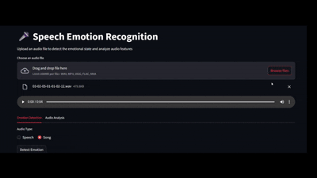

# 🎤 Speech Emotion Recognition (SER) System  
### **"Hear the Unspoken"** - Our advanced AI system detects nuanced emotional states from speech with **82% accuracy**, transforming raw audio into emotional insights. This cutting-edge solution combines deep learning with acoustic analysis to reveal the hidden emotional context in human speech.

---



---

# Key Metrics
## 📸 Screenshot

<div align="center">
  
  
</div>


---

## 🌟 Key Features  
- **State-of-the-art** deep learning model achieving **82% accuracy**  
- **Real-time capable** emotion detection from audio streams  
- **8 emotion classes** (Angry, Happy, Sad, etc.) with confidence scores  
- **Interactive visualization** of emotion probabilities and audio characteristics 
- **Comprehensive analytics** including F1 scores and confusion matrices  

---

## 🚀 Performance Highlights  


## 🧠 Intelligent Architecture  


### 🔍 Feature Extraction Pipeline  


### 🏗️ Deep Neural Network  
```python
Sequential([
    Dense(256, activation='relu', input_shape=(n_features,)),
    BatchNormalization(),
    Dropout(0.3),
    Dense(128, activation='relu'),
    BatchNormalization(),
    Dropout(0.3), 
    Dense(64, activation='relu'),
    BatchNormalization(),
    Dropout(0.2),
    Dense(8, activation='softmax')  # 8 emotions
])
```

---

## 💻 Getting Started  

### ⚡ Quick Deployment  
```bash
# Clone the repository
git clone https://github.com/yourrepo/speech-emotion-recognition.git

# Install dependencies (Python 3.8+ required)
pip install -r requirements.txt


### 🧪 Sample Output  
```json
{
  "emotion": "happy",
  "confidence": 0.87,
  "analysis": {
    "arousal": "high",
    "valence": "positive",
    "intensity": 0.79
  }
}
```

## 🛠️ Customization Options  

```yaml
# config/tuning.yaml
hyperparameters:
  learning_rate: 0.001
  batch_size: 32
  dropout: 0.3
  
features:
  mfcc: true
  chroma: true  
  spectral: true
```

Here's a polished version for your README.md that showcases your Streamlit deployment professionally:

---

## 🚀 **Live Web Deployment with Streamlit**

We've transformed our advanced emotion recognition model into an **interactive web application** using Streamlit, making it accessible to anyone through their browser. This deployment showcases the full power of our SER system with an intuitive interface.

### **Key Features of the Web App**

✨ **User-Friendly Interface**  
- Drag-and-drop audio file uploader
- Real-time audio playback
- Clean, responsive design

📊 **Comprehensive Analysis**  
- Instant emotion prediction with confidence scores
- Interactive tabs for different analysis views
- Professional audio visualizations:
  - Waveform displays
  - Spectrograms
  - MFCC heatmaps
  - Spectral centroid tracking

⚙️ **Technical Excellence**  
- Supports multiple formats (WAV, MP3, FLAC)
- FFmpeg integration for robust audio processing
- Cached models for fast predictions
- Detailed error handling and user guidance

### **Try It Yourself**

```python
import streamlit as st
from pydub import AudioSegment

# Configure the app
st.set_page_config(page_title="Speech Emotion Recognition", layout="wide")
st.title("🎤 Speech Emotion Recognition")

# File uploader
uploaded_file = st.file_uploader("Choose an audio file", type=["wav", "mp3", "flac"])

if uploaded_file:
    # Immediate audio feedback
    st.audio(uploaded_file)
    
    if st.button("Detect Emotion"):
        with st.spinner("Analyzing emotional content..."):
            # Feature extraction and prediction
            emotion = predict_emotion(uploaded_file)
            st.success(f"**Predicted Emotion:** {emotion}")
```


### **Deployment Architecture**


**Pro Tip**: For best results, use clear speech recordings (minimum 2 seconds duration) in quiet environments.


---

## 📜 License  
**MIT License** - Free for academic and commercial use with attribution  

--- 


> "Emotion is the hidden dimension of speech - we make it measurable"  

